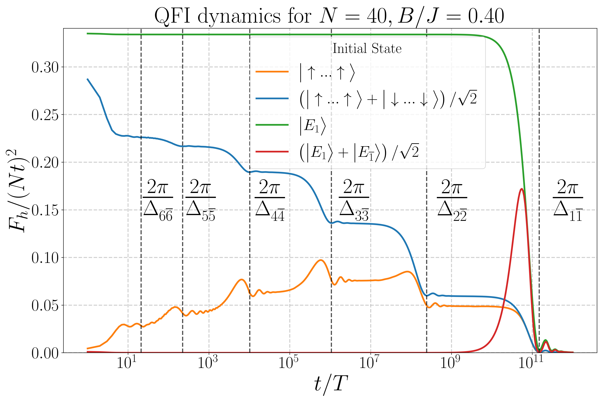

# QFI Dynamics in LMG Model

Simulation of Quantum Fisher Information dynamics in the Lipkin-Meshkov-Glick model. See paper: https://arxiv.org/abs/2505.22731

```math
\hat{H}(t) = -\frac{2J}{N} \hat{S}_z^2 - 2 B \hat{S}_x - \pi \sum_{m=1}^{\infty} \delta(t - mT) \hat{S}_x + \hat V(t)
```




## Installation

Requires [uv](https://docs.astral.sh/uv/):
```bash
conda env create -f environment.yml
# activate env 
conda activate lmg_qfi
uv sync
```

## Usage

```bash
# Run simulation for all initial states
uv run python quantum_fisher_information_simulation_mpmath.py

# Run for specific initial state (GS_phys, GS_cat, CatSum, Phys)
uv run python quantum_fisher_information_simulation_mpmath.py --init-state GS_phys

# Custom parameters
uv run python quantum_fisher_information_simulation_mpmath.py --system-size 20 --x-coupling 0.4

# Generate plot from existing results
uv run python quantum_fisher_information_simulation_mpmath.py --plot
```


## Tests

```bash
uv run pytest tests/ -v                    # Run all tests
uv run pytest tests/test_operators.py -v   # Run specific module
uv run pytest tests/ -v --cov=lmg_qfi      # With coverage
```


## Library Usage

```python
from lmg_qfi import (
    create_hamiltonian_h0,
    create_spin_xyz_operators,
    run_simulation,
    InitialState,
    SimulationParams,
)
import mpmath as mp

H = create_hamiltonian_h0(J=1.0, B=0.4, num_spins=10)
Sz, Sx, Sy = create_spin_xyz_operators(n=10)

params = SimulationParams(
    run_arguments={"dps": 50, "steps_floquet_unitary": 100, "num_points": 50},
    N=10,
    J=mp.mpf(1.0),
    B=mp.mpf(0.4),
)
results = run_simulation(params, [InitialState.GS_CAT])
```
