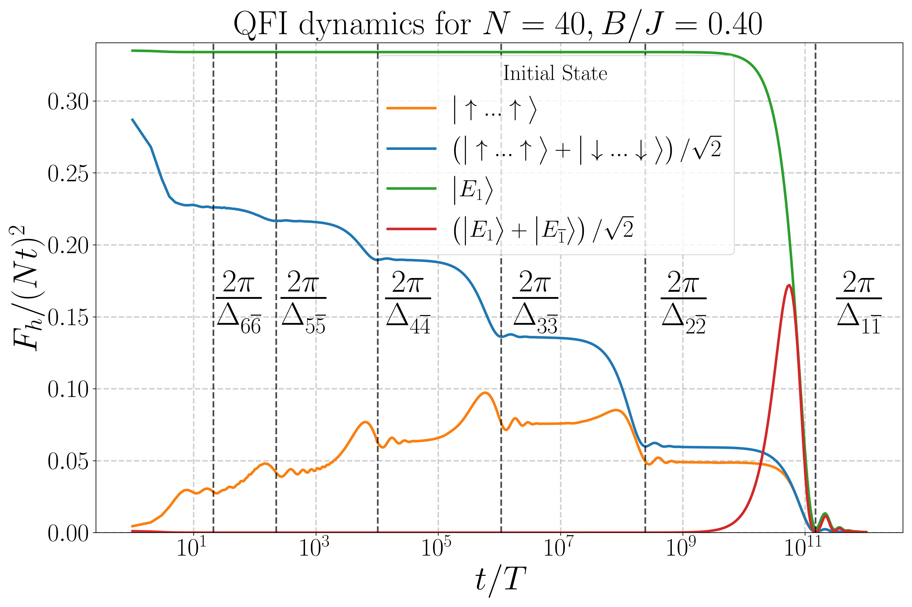

# QFI Dynamics in LMG Model

Simulation of Quantum Fisher Information dynamics in the Lipkin-Meshkov-Glick model. See paper: https://arxiv.org/abs/2505.22731

```math
\hat{H}(t) = -\frac{2J}{N} \hat{S}_z^2 - 2 B \hat{S}_x - \pi \sum_{m=1}^{\infty} \delta(t - mT) \hat{S}_x + \hat V(t)
```




## Installation

Requires [uv](https://docs.astral.sh/uv/):
```bash
conda env create -f environment.yml
# activate env 
conda activate lmg_qfi
uv sync
```

## Usage

A single entry script runs the simulation with one of two interchangeable
backends: `quspin` (fast, double precision, the default) or `mpmath`
(arbitrary precision). The backend is selected by the `solver` key in
`parameters.ini` and can be overridden per run with `--solver`.

```bash
# Run simulation for all initial states (quspin solver by default)
uv run python quantum_fisher_information_simulation.py

# Run for specific initial state (GS_phys, GS_cat, CatSum, Phys)
uv run python quantum_fisher_information_simulation.py --init-state GS_phys

# Custom parameters
uv run python quantum_fisher_information_simulation.py --system-size 20 --x-coupling 0.4

# Arbitrary-precision mpmath backend
uv run python quantum_fisher_information_simulation.py --solver mpmath --init-state GS_phys

# Generate plot from existing results (matches the active solver's files)
uv run python quantum_fisher_information_simulation.py --plot
```

Results are saved to `results/<solver>.<state>_N=<N>_B=<B>.csv` (e.g.
`results/quspin.GS_phys_N=10_B=0.40.csv`); the figure is saved as
`results/qfi_dynamics_N=<N>_B=<B>_<solver>.png`.


## Frequency-estimation mode (QFI over the drive frequency)

By default the QFI is computed with respect to the AC amplitude $h$. With
`--parameter frequency` (or `parameter = frequency` in `parameters.ini`) the estimated
parameter is the drive frequency $\omega$ instead:

```math
|\partial_\omega \psi(t)\rangle \approx \frac{|\psi(t;\omega+\epsilon)\rangle - |\psi(t;\omega-\epsilon)\rangle}{2\epsilon},
\qquad
F_\omega = 4\left(\langle\partial_\omega\psi|\partial_\omega\psi\rangle - |\langle\psi|\partial_\omega\psi\rangle|^2\right).
```

Generating the frequency-mode graph $F_\omega/(N^2 t^4)$ versus $t/T$ takes two
steps — run, then plot:

```bash
# 1. Run all four initial states at the resonant probe frequency
#    omega_0 = 2*pi/(nu*T); writes results/quspin.Fomega.<state>_N=10_B=0.40.csv
#    (quspin solver, ~1000x faster than mpmath; default cap t <= 10^6)
uv run python quantum_fisher_information_simulation.py \
    --parameter frequency --amplitude 0.1

# 2. Generate the graph from the Fomega.* CSVs;
#    saves results/qfi_dynamics_Fomega_N=10_B=0.40_quspin.png with N, B/J, h,
#    omega in the title and a logarithmic y axis
uv run python quantum_fisher_information_simulation.py \
    --plot --parameter frequency

# Same two steps with the arbitrary-precision mpmath solver
# (default cap t <= 10^4 periods; sequential cost is linear in t_max)
uv run python quantum_fisher_information_simulation.py --solver mpmath \
    --parameter frequency --amplitude 0.1 --init-state GS_phys --max-time-degree 3
uv run python quantum_fisher_information_simulation.py --solver mpmath \
    --plot --parameter frequency
```

The CLI flags can also be set once in `parameters.ini`, after which the plain
`uv run python quantum_fisher_information_simulation.py` (and `--plot`)
runs in frequency mode:

```ini
[Simulation]
; numerical backend: quspin | mpmath
solver = quspin
parameter = frequency
; frequency estimation requires a nonzero AC amplitude
h = 0.1
; "resonant" = 2*pi/(frequency*T), or an explicit float value
omega = resonant
```

Physics and numerics notes:

- **Phase-continuous drive.** At $\omega \pm \epsilon$ the field
  $h\sin(\omega t + \phi_0)$ is no longer commensurate with the kick period, so the
  Floquet-power shortcut $U(nT) = U_F^{\,n}$ does not apply (it would silently reset the
  drive phase every AC cycle and erase the secular phase drift
  $\phi_0 + m\,\epsilon\,\nu T$, which carries the long-time $\omega$ signal). The three
  trajectories $|\psi(t;\omega)\rangle$, $|\psi(t;\omega\pm\epsilon)\rangle$ are therefore
  propagated kick period by kick period with the drive phase running over absolute time.
  Cost is linear in the largest requested time: roughly 0.2 s/period for mpmath at
  $N=10$, dps 15 (about 30 min to $t=10^4$), and about $10^3\times$ faster for QuSpin
  (about 30–45 min to $t=10^6$).
- **Nonzero amplitude required.** At $h=0$ the drive vanishes and $F_\omega \equiv 0$;
  frequency mode raises an error unless $h \neq 0$ (e.g. `--amplitude 0.1`).
- **Normalization.** The `qfi` CSV column stores $F_\omega/(N t^2)^2$ (the generator
  $\partial_\omega H = h\,t\cos(\omega t + \phi_0)S_\alpha$ grows linearly in time);
  the unnormalized value stays in `qfi_raw`. Amplitude mode keeps $F_h/(N t)^2$.
- **Probe frequency.** Defaults to the resonant value $\omega_0 = 2\pi/(\nu T)$;
  override with `--omega` or the `omega` key in `parameters.ini`.
- **Finite-difference step.** $\epsilon = \min\!\left(10^{-\mathrm{dps}/2},\,
  0.1/(h N t_{\max})\right)$ keeps the central difference in its linear regime up to the
  longest simulated time; raise `dps` if the log warns that $\epsilon$ approaches the
  working precision.
- Frequency-mode results are written with an `Fomega.` prefix after the solver
  tag (`<solver>.Fomega.<state>_N=<N>_B=<B>.csv`) so the two modes never mix in
  one figure; `--plot` additionally matches only the active solver's files.
- Possible follow-up if long-time mpmath runs become necessary: a commensurate step
  $\epsilon = 2\pi k/(M\nu T)$ makes the shifted drives exactly periodic over the
  super-period $M\nu T$, restoring an $O(1)$ Floquet-power path at the price of a fixed
  $\epsilon$ grid and an $O(M)$ setup.

### Dynamics figure at a detuned probe frequency

The frequency-mode analogue of `qfi_dynamics_N=40_B=0.40.png` — $F_\omega/(Nt^2)^2$
versus time for all four initial states — at a detuned probe frequency
$\omega = 1.1\,\omega_0$ ($= 1.1 \cdot 2\pi/(\nu T) = 1.1\pi \approx 3.4557519$ for
$\nu = 2$, $T = 1$) and $h = 0.1$:

```bash
# 1. Run all four initial states (quspin; t <= 10^4, ~minutes for N=40)
uv run python quantum_fisher_information_simulation.py \
    --parameter frequency --amplitude 0.1 --omega 3.4557519 \
    --system-size 40 --max-time-degree 4

# 2. Render the figure from the Fomega.* CSVs
uv run python quantum_fisher_information_simulation.py \
    --plot --parameter frequency --system-size 40
```

The figure is saved as `results/qfi_dynamics_Fomega_N=40_B=0.40_quspin.png` (the
`_Fomega` tag keeps it from overwriting the amplitude-mode figure); the y axis is
logarithmic because $F_\omega/(Nt^2)^2$ spans many decades. The same two commands
with `--solver mpmath` run the arbitrary-precision solver instead (use a smaller
`--max-time-degree`).

### Parallel runs

`run_simulation_parallel.sh` launches the simulation for all initial states in
parallel and then renders the figure. The solver and estimation mode pass through
via environment variables:

```bash
# Amplitude mode with the default solver from parameters.ini
./run_simulation_parallel.sh

# Frequency mode with the mpmath backend
SOLVER=mpmath PARAMETER=frequency AMPLITUDE=0.1 MAX_TIME_DEGREE=3 ./run_simulation_parallel.sh
```


## Solvers

Two interchangeable backends implement the same Floquet algorithm:

- **quspin** (default) — [QuSpin](https://quspin.github.io/QuSpin/) spin operators
  with `scipy`/`numpy` double-precision evolution, ~800–1000× faster than mpmath
  at dps=15.
- **mpmath** — arbitrary-precision reference; raise `dps` in `parameters.ini` for
  high-precision runs.

Select the backend with the `solver` key in `parameters.ini` or per run with
`--solver quspin|mpmath`. Output files carry the solver name as a prefix (CSV)
or suffix (figure), so the two backends never mix in one figure.

### Library usage (quspin backend)

```python
import numpy as np
from lmg_qfi.quspin_solver import get_spin_operators, build_h0, run_quspin_simulation

N, J, B = 10, 1.0, 0.4

Sz, Sx, Sy = get_spin_operators(N)
H0 = build_h0(J, B, N, Sz, Sx)

params = dict(
    N=N, J=J, B=B, T=1.0, nu=2, phi=np.pi, h=0.0,
    epsilon=1e-7, steps_floquet_unitary=10,
    varphi=0.0, theta=0.0, phi_0=0.0,
)

# Initial state: all spins up |N/2, N/2>
psi0 = np.zeros(N + 1, dtype=complex); psi0[0] = 1.0

time_points = list(range(1, 100)) + [200, 500, 1000]
results = run_quspin_simulation(params, time_points, psi0)

for r in results[:5]:
    print(f"t={r.time:4d}  QFI={r.qfi:.6e}  mz={r.m_z:.4f}")
```

The high-level wrapper `run_quspin` mirrors `run_simulation` (it builds the
initial states and the time grid itself):

```python
import mpmath as mp
from lmg_qfi import InitialState, SimulationParams
from lmg_qfi.quspin_solver import run_quspin

params = SimulationParams(
    run_arguments={"dps": 15, "steps_floquet_unitary": 10, "num_points": 100},
    N=10, J=mp.mpf(1.0), B=mp.mpf(0.4),
)
results = run_quspin(params, [InitialState.GS_CAT])
```

### QuSpin solver tests

```bash
uv run pytest tests/test_quspin_solver.py -v
```

The test suite covers operator correctness, Floquet unitarity, QFI non-negativity,
and numerical agreement with the mpmath reference for N=20.

## Tests

```bash
uv run pytest tests/ -v                    # Run all tests
uv run pytest tests/test_operators.py -v   # Run specific module
uv run pytest tests/ -v --cov=lmg_qfi      # With coverage
```


## Library Usage

```python
from lmg_qfi import (
    create_hamiltonian_h0,
    create_spin_xyz_operators,
    run_simulation,
    InitialState,
    SimulationParams,
)
import mpmath as mp

H = create_hamiltonian_h0(J=1.0, B=0.4, num_spins=10)
Sz, Sx, Sy = create_spin_xyz_operators(n=10)

params = SimulationParams(
    run_arguments={"dps": 50, "steps_floquet_unitary": 100, "num_points": 50},
    N=10,
    J=mp.mpf(1.0),
    B=mp.mpf(0.4),
)
results = run_simulation(params, [InitialState.GS_CAT])
```
